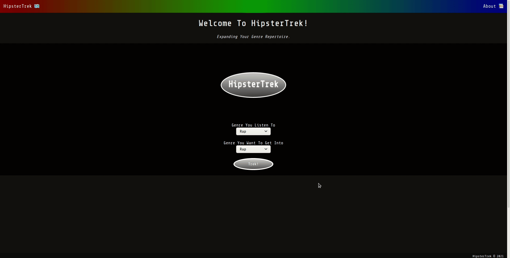
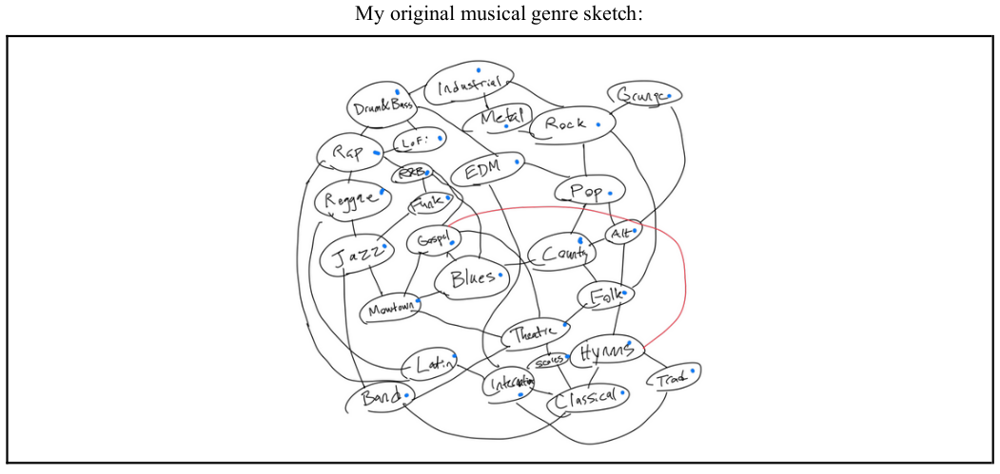
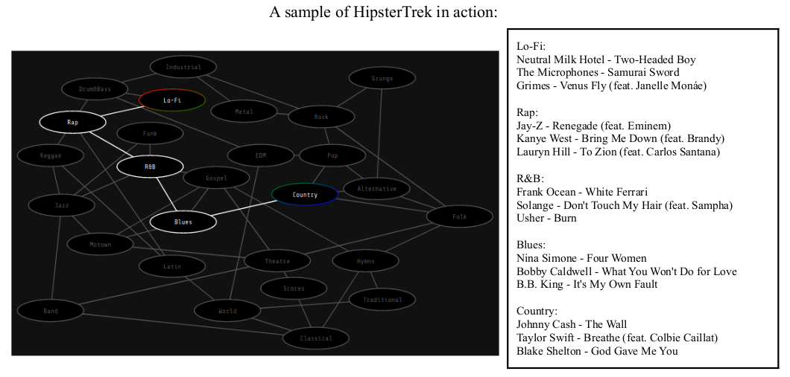
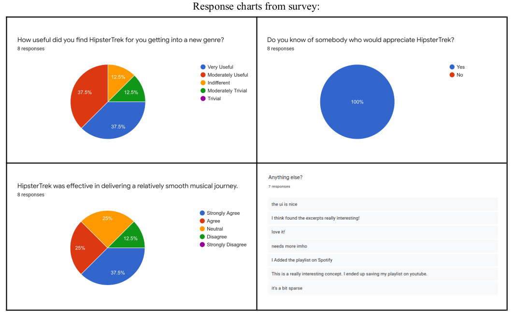

# HipsterTrek

An Implementation Based DSA Final Project

Tolulope Oshinowo (he/him/his)

Project Website: https://hipstertrek.herokuapp.com    
Video Link: https://www.youtube.com/watch?v=fxyMPFuWxsc

**Initial Questions and Inspirations:**    
Over the past few decades we have seen the global music industry evolve at continuously increasing rates, and with this phenomenon comes the advent of music becoming more accessible to individuals overall. Just like how no two people share the exact same character traits, our music tastes vary from person to person as well. This notion had me thinking about different major music genres and how it could be possible to find similarities between them and create a basic graphical representation. In the process of creating this map one question began to rise in my mind: could it be possible to create an algorithm that would offer the shortest path to go from one music genre to another? This became the basis for my implementation project.

**Implementation and Methodology:**    
Personally I would say that I often look for sonic diversity when it comes to the music that I listen to, but I knew that mapping out tens of genres on my own would be a task that would have me in over my head. With this in mind I began to look for online resources that had already done the heavy lifting of connecting genres together. I eventually settled upon using the website “musicmap.info” because of the extensive work done on relating genres to one another based on instrumentation, evoked emotion, and historical contexts. Once I had a primary source to pull from I made a rough graph sketch of some of the more major music genres.From there I began to look up different graph traversal algorithms, primarily those used in finding the shortest path between two nodes. I was a bit lost at this point in the process, but it was during that week that we happened to learn about the Dijkstra graph traversal algorithm in class which was exactly what I was looking for. Since I was developing a web app with NodeJS for my project I had to take the time to learn the JavaScript equivalents of the Python data structures that we used to implement Dijkstra in class. Thanks to the class notes and several Mozilla JavaScript documentation pages this process ended up being a surprisingly smooth endeavor, albeit taking a lot of time in the reading and trial and error departments. Once I had the Dijkstra algorithm working for a small dataset I then spent some time expanding the test graph to encapsulate all of the genres from my original sketch as nodes.    

With the engine that would drive my web app completed I then appropriately weighted all of the edges in the graph and then set my sights on the front end. I was able to build out the front end of HipsterTrek using D3JS with Express to send information to and from the user’s input.

**Putting HipsterTrek to the Test:**    
In order to test my algorithm I figured that the easiest way would be to select a music pathway and then see if I could find an alternate path that would take less steps based on the weights that I set for each edge between any two given nodes. Long story short I was unable to find a pathway that could beat my algorithm. This was a good sign as it indicated that I had implemented Dijkstra correctly. Soon enough though I realized that the real test would be to see if the actual transitions between music genres was seamless enough that someone who listens primarily to a genre like Pop could get into a genre like Reggae in a relatively short amount of time. To test out the viability of HipsterTrek I asked eight different people to try out HipsterTrek, first selecting the genre that they are most familiar with as the starting node and then selecting a genre that they want to get into as the ending node. From there they were asked to create a playlist that consisted of at least one track from each suggested album from each node that would be a part of their musical journey in order. Below is an example of what a possible pathway with an accompanying playlist would look like:

After giving this group of people the instructions I had them fill out a short Google Form to get their feedback as a final verdict as to how effective HipsterTrack truly is. Below are the results:

**Final Thoughts:**    
Of the eight people surveyed, six said that they found HipsterTrek to be at least moderately useful, all eight people indicated that they knew of somebody who would appreciate HipsterTrek, seven of eight stated that HipsterTrek demonstrated an ability to go from one genre to another relatively smoothly, and two of eight people mentioned that they thought that the playlists that they received using HipsterTrek were worth saving to their library on their respective streaming platform. Judging from this feedback I believe that a good argument can be made for the effectiveness of HipsterTrek. Using Dijkstra’s shortest path graph traversal algorithm I was able to develop a moderately useful platform for people to expand their musical palettes with. In addition to that I can confidently say that throughout this project I learned a lot about the capabilities of search/pathfinding algorithms, web development, and the versatility of data structures like priority queues and hash tables.

