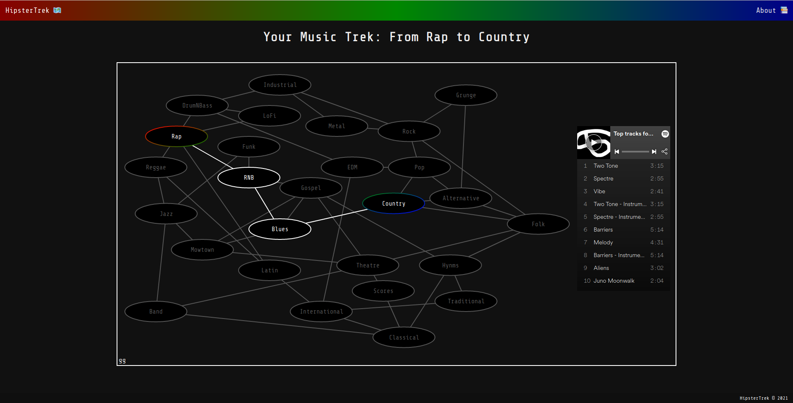

# HipsterTrek

An Implementation Based DSA Final Project

Tolulope Oshinowo (he/him/his)

**References:**
https://musicmap.info/
https://opendsa-server.cs.vt.edu/ODSA/Books/CS3/html/
https://github.com/d3/d3/wiki

**Proposal:**
Over this past semester there has been a wide range of topics discussed, but personally the one that I find the most interesting is graph traversals. I find it fascinating how one can take a set of nodes, connect them to each other, and then develop an algorithm that navigates though this net in an optimized fashion. This phenomenon has inspired me to create an application that borrows from algorithms like Prim’s and Kruskal’s to map out a path that an individual could take to get into varying musical genres most efficiently. I decided to call this implementation-based project “HipsterTrek” because as the user uses the app, they embark on a trek starting from the genre that they are the most familiar with and ending at the genre they want to get into with different songs along the way.

In terms of references for this project I have come across a website with extensive information regarding different musical genres and their relations to one another. The best part about this specific source is that the main page incorporates a map but considering the time constraints I will probably start out with just the major sections and build a graph on my own using this website as a guide. The second reference that I will be using will be chapter 14 of this online textbook that I found that goes in-depth describing and giving examples of different graph implementations and how they can be traversed. This will be helpful because I want to better understand the customizability of graphs and then I want to create a hybrid traversal algorithm for my graph of songs from different genres. The final preliminary source that I have is the documentation page for d3js which is a JavaScript visualization library designed for data visualization. This will come in handy when I begin setting up the more-front end part of the webapp.

Below is a timeline for this project:

---

*April:*
4/14/2021: Finalize Graph Architecture.
4/17/2021: Finalize Traversal Algorithm.
4/19/2021: Implement a Dataset into the Graph and test traversal.
4/21/2021: Begin work on visualization.
4/26/2021: Set up a database to store individual graphs.
4/28/2021: Connect front end (visualization) to back end (algorithm and graph data).

*May:*
Time in May will be used to debug, compile deliverables, and produce presentation.
